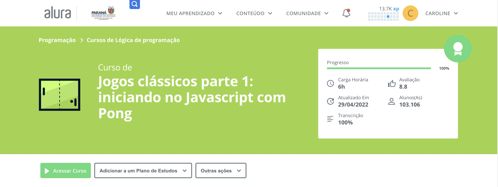
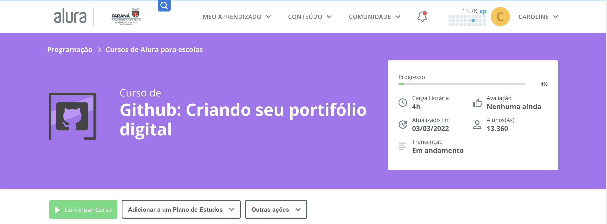

# PensamentoComputacional
Repositório da disciplina Pensamento Computacional no Novo Ensino Médio

## Conteúdo abordado durante o 1º Trimestre

1. [Jogos clássicos parte 1: iniciando no Javascript com Pong](https://cursos.alura.com.br/course/pong-javascript)
   - [Pong no Scratch](https://cursos.alura.com.br/course/pong-javascript/task/56081)
   - [Iniciando no javascript](https://cursos.alura.com.br/course/pong-javascript/task/56090)
   - [Criando minha raquete no jogo](https://cursos.alura.com.br/course/pong-javascript/task/56098)
   - [Criando a raquete do oponente](https://cursos.alura.com.br/course/pong-javascript/task/56105)
   - [Editando placar e adicionando sons](https://cursos.alura.com.br/course/pong-javascript/task/56111)

2. [Github: Criando seu portifólio digital](https://cursos.alura.com.br/course/github-criando-portifolio-digital)
   - [Começando no GitHub](https://cursos.alura.com.br/course/github-criando-portifolio-digital/task/100572)
   - [Criando repositórios no GitHub](https://cursos.alura.com.br/course/github-criando-portifolio-digital/task/100575)
